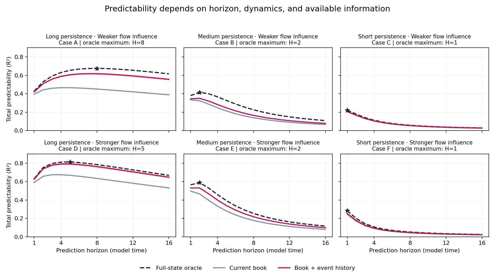

# Limit-order-book research

## Why this research?

When designing an alpha strategy, how should we choose the prediction horizon?
Once that horizon is fixed, can finer order-book dynamics reveal predictive
information that coarse summaries miss? For example, could intraday events help
predict a one-day price change?

These questions motivate this research. A daily target need not imply that daily
observations are sufficient, and a shorter horizon need not always be easier to
predict. The aim is to understand **which information is useful at which horizon,
and why**.

This portfolio starts with controlled synthetic models, where the generating
process is known and numerical results can be checked against exact calculations.
Real-market validation and strategy evaluation remain future work.

## How the questions are investigated

The experiments distinguish three choices: how far ahead to predict, how finely
to observe the market, and how much history to retain. They compare:

- **Current book:** what can be predicted from the present queue sizes alone.
- **Book + event history:** what past observations add to that prediction.
- **Full-state oracle:** a reference that also knows the current hidden state,
  but cannot see future events.

The target is the cumulative price change over the prediction horizon; R² measures
the fraction of its variance explained by the predictor, using each horizon’s own
return variance as the reference.

This separates the predictive value already visible in the book, the additional
value of history, and the gap to full-state information. Model definitions,
parameter settings, and evaluation equations are in the
[model and measurement note](docs/horizon_model_details.md).

## Why a renormalization-group perspective?

Renormalization-group methods inspired a further question: as detailed events are
replaced by coarser observations, what survives in the effective dynamics?
The goal is to connect changes in observation scale with changes in useful
information and predictive time horizons.

Mori–Zwanzig projection provides a way to describe memory introduced by removing
detail or restricting a representation. The experiments assess that memory
separately from forecasting gains: a nonzero memory kernel alone does not establish
that history improves prediction. The horizon sweep below varies the prediction
target, not observation resolution; the next question is how its predictability
curves change when observations are made coarser. A closed RG description remains
an open goal.

## Research map

| Study | What it contributes |
|---|---|
| [Queue depletion](studies/queue_depletion/README.md) | Connects queue events, depletion, and timing to price changes. |
| [Linear-Gaussian controls](studies/memory_and_prediction/README.md) | Checks projected memory and estimation against exact references. |
| [Finite-LOB projection](studies/memory_and_prediction/experiments/finite_lob_bridge/README.md) | Separates missing state information from a restricted linear representation. |
| [Continuous-time LOB](studies/continuous_time_lob/README.md) | Compares current observations and histories against a full-state oracle. |

These are complementary controlled models, with their assumptions documented
separately. The horizon comparison below extends the continuous-time study.

## What we know so far

The horizon sweep reveals three related findings within the tested synthetic model.

Columns vary hidden-direction persistence from long to short; rows vary its
influence on order flow from weaker to stronger. All panels use the same vertical
scale. The black dashed curve is the full-state oracle; gray uses the current book;
pink adds event history. Stars mark oracle maxima on the tested horizon grid.
Shading shows pointwise 95% intervals for the path-based estimates.
The [model note](docs/horizon_model_details.md) maps Cases A–F to their settings.

### 1. Some settings have an interior predictability maximum

Is the shortest horizon always the most predictable, even with complete current
information? To isolate this question from observation limits, we hold each model
fixed and compare its full-state oracle across horizons 1–16.

In Case A, oracle R² is highest at horizon 8; in Case D, at horizon 5. Other settings
peak at the shortest tested horizon. Thus the model can have an interior maximum
in total predictability before incomplete observation is introduced.

### 2. The maximizing horizon changes with the dynamics

Does hidden-state persistence alone determine that maximum? Cases A and D hold
persistence fixed while changing how strongly the hidden direction affects order
flow. Comparing their oracle curves removes differences in available information.

The grid maximum moves from horizon 8 to 5. Hidden persistence alone therefore
does not determine the preferred horizon. This comparison establishes a dependence
on the model setting; explaining it through interacting timescales remains open.

### 3. History can improve both the level and the horizon profile of prediction

What changes when past observations are added to the current book? Within each
model, we compare current-book and event-history predictors on the same paths,
at the same scoring times and target horizons, with the oracle as a reference.

In Case A, history raises R² and moves the maximum from around horizons 4–5 to 7.
The gap between pink and gray shows the improvement at each horizon. History can
therefore change both how much is predictable and which tested horizon is best.
The remaining oracle gap includes information unavailable from those observations;
it is not all an opportunity for a better fitted predictor.

These findings concern known-parameter synthetic models and integer horizons 1–16
in model time. They do not identify a continuous optimum or a profitable holding
period. Some peaks are nearly flat: in Case D, the history estimates at horizons
4 and 5 are not statistically distinguished by their paired pointwise interval.

## What comes next?

The next questions are how the preferred horizon changes across model conditions,
which combinations of timescales explain that movement, and how much predictability
survives when observations are made coarser. Unknown-parameter estimation and
real-market data are needed to test whether the findings carry beyond these controls.
Choosing a trading horizon additionally requires costs, turnover, and risk.

## Reproduction and technical detail

The [model and measurement note](docs/horizon_model_details.md) defines the horizon
experiment, its checks, and the location of its implementation and results.
The figure and numerical summaries of the dense sweep are included here. Its full
implementation and path-level outputs are maintained in the private research
repository; the public baseline reproduction does not yet regenerate this extension.

For the currently published studies, see the
[reproduction guide](docs/reproduction.md),
[verification record](docs/verification.md),
and [assumptions and limitations](docs/validation_and_limitations.md).
For the projection derivation, see the
[Mori research note](docs/mori_projection_notes.md).

All included research uses synthetic data. This is a curated research portfolio;
see [rights and attribution](NOTICE.md).
