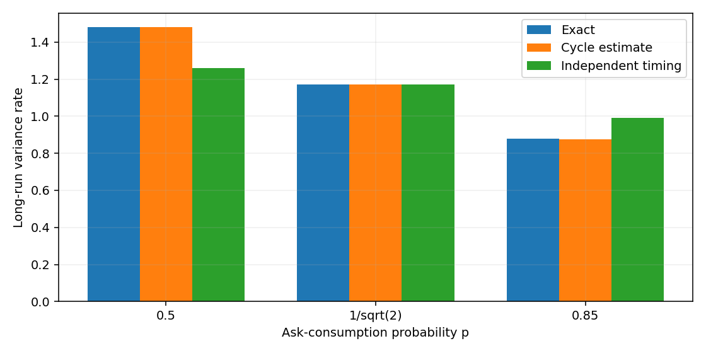
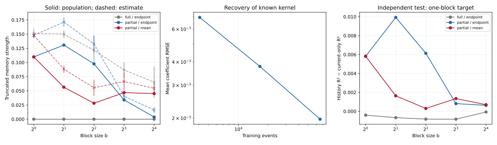
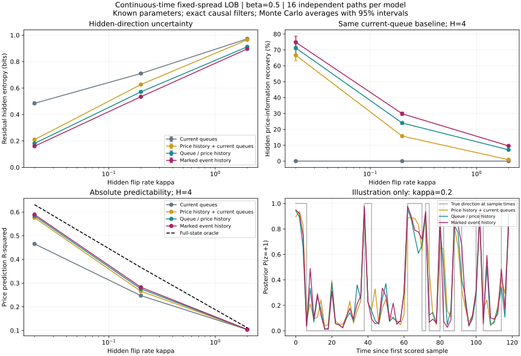

# Limit-order-book research

**Synthetic experiments on queue depletion, price formation and memory under partial observation.**

This portfolio connects tractable stochastic models to executable numerical
controls. It asks when a queue depletes, which side moves price first, and what
predictive information is lost when the full state is only partially observed.
All data are synthetic. No market calibration or trading profitability is claimed.

## Read in 5–10 minutes

| Question | Main finding within the model | Start here |
|---|---|---|
| Which queue depletes first? | Queue sizes and consumption rates determine directional probability; direction and waiting time can be dependent. | [Queue-race notebook](studies/queue_depletion/notebooks/queue_race.ipynb) |
| Does higher activity imply higher volatility? | Alternating jumps can have high quadratic variation but bounded price dispersion. | [Jump-dependence notebook](studies/queue_depletion/notebooks/toy_volatility.ipynb) |
| Why can an observed process need history? | Partial observation and time aggregation can create effective memory even when the full dynamics are Markov. | [Memory benchmark](studies/memory_and_prediction/README.md) |
| What information does an event stream retain? | Known-parameter filtering compares event marks, queue/price history and current queues against a full-state oracle. | [Continuous-time baseline](studies/continuous_time_lob/README.md) |

### Queue races: covariance matters



The independent-timing comparison preserves cycle marginals but removes their
within-cycle dependence. Omitting direction–waiting-time covariance can overstate
or understate the regenerative variance rate. Bars compare theory and 100,000
simulated cycles per condition, not empirical market estimates.

### Memory: exact controls before prediction



Population constructions provide independent references for estimated kernels.
The prediction panel uses a one-block target, whose event horizon changes with
block size; fixed-event-target results are separately recorded in the CSV.
Mori memory coefficients are not fitted regression coefficients.

### Continuous time: known-parameter information recovery



The baseline uses 16 independent paths per model across nine parameter settings.
Intervals describe variability across paths; filters know the synthetic parameters.
Information-recovery ratios depend on their specified baseline and denominator.

## Reproduce

Python 3.11 or 3.12 is supported. From the repository root:

```sh
python -m venv .venv
source .venv/bin/activate
python -m pip install -e '.[research]'
python -m unittest discover -s tests -v
python scripts/run_notebooks.py queue_race
```

See [full reproduction commands](docs/reproduction.md),
[recorded verification](docs/verification.md), and [result provenance](results/README.md).
No external data service or credentials are needed.

## Research map

- [Queue depletion](studies/queue_depletion/README.md): first passage, censoring,
  cancellation, market consumption, replenishment and bid/ask races.
- [Memory and prediction](studies/memory_and_prediction/README.md): linear controls,
  finite-state LOB moments, queue imbalance and fixed-horizon prediction drivers.
- [Continuous-time LOB](studies/continuous_time_lob/README.md): generator, simulation
  and causal filtering with known parameters.
- [Assumptions](docs/model_assumptions.md), [limitations](docs/validation_and_limitations.md),
  [references](docs/references.md), and [data provenance](docs/data_provenance.md).

## What remains open

Variable-spread competition, realistic order sizes and resets, estimation of
unknown parameters, model misspecification, and replication on licensed public
data remain future work. Closed RG equations, universal market scaling and
profitable trading strategies are not established by these experiments.

This is a curated research release, not a production matching or execution system.
See [rights and attribution](NOTICE.md); public access does not grant an open-source license.
