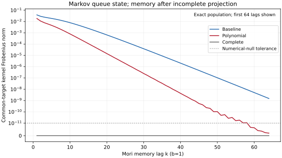
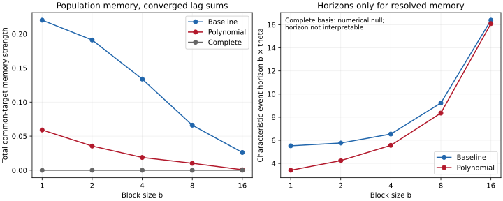

# Finite-LOB bridge: Markov queues, projected Mori memory

## 1. What is the microscopic Markov state?

This is the existing synthetic finite-state event model, not a new simulator.
The state after event t is $X_t=(Q^b_t,Q^a_t)$, with each quantity in
$\{1,\ldots,8\}$: 64 states. Bid/ask additions each have probability 0.2;
bid/ask removals each have probability 0.3. Market consumption and cancellation
have identical queue effects here. Capped additions count as self-transitions;
depletion refills only the depleted side to 8 and moves price by one tick.
The opposite queue is retained, spread is fixed, and no hidden direction is added.

The complete queue chain is Markov. The linear-Gaussian study is the methodological
control; this experiment transfers its projection question into an actual queue
model before the separate continuous-time hidden-flow inference study.

## 2. What information is discarded in each projection?

All features are centered under the stationary population law. For a block of b
events, let q_b,q_a be its endpoint quantities, N_a,N_b its ask/bid removal counts,
and R its sum of signed price jumps. Define

$$I=\frac{q_b-q_a}{q_b+q_a},\qquad
D=\begin{cases}(N_a-N_b)/(N_a+N_b),&N_a+N_b>0,\\0,&N_a+N_b=0.\end{cases}$$

| Representation | Centered feature vector | Dimension at cap=8 |
|---|---|---:|
| Baseline | $(I,D,R)$ | 3 |
| Polynomial | $(I,D,R,q_b/8,q_a/8,(q_b/8)^2,(q_a/8)^2,q_bq_a/64)$ | 8 |
| Complete | Indicators for every endpoint state except (8,8), followed by D,R | 65 |

Baseline discards absolute queue sizes and most state functions. **Polynomial
restores both queue coordinates and therefore all endpoint-state information**;
it is not informationally incomplete about X. Its *linear projection span* still
omits many nonlinear state functions. Complete spans every centered function of
the endpoint state; the omitted indicator removes the constant dependence. I is
recoverable from those indicators. D and R are block/event observables, not extra
hidden microscopic state variables.

## 3. Why can memory appear after projection?

Predicting the next observation can require state functions outside the chosen
linear span. Eliminating these unresolved functions produces Mori memory.
Thus a nonzero linear Mori kernel does not by itself prove that the observed
coordinates are non-Markov: the Polynomial coordinates contain X, but their
finite polynomial span need not be invariant under the transition operator.

At each scale, queues use block endpoints, R sums event returns, and D is formed
from aggregated removal counts (not averaged event ratios). This reuses the
repository's exact block-population construction. It changes the observed
features, not the microscopic transition law.

## 4. What is measured?

With centered feature vector Y and $C_\ell=E[Y_{j+\ell}Y_j^T]$, the existing
covariance convention gives

$$\Omega_n=\left(C_{n+1}-\sum_{j=0}^{n-1}\Omega_j C_{n-j}\right)C_0^{-1}.$$

$\Omega_0$ is the instantaneous Markov contribution and is **excluded** from memory.
Let T map each basis to the same centered target (I,D,R), and let
$C_*=TC_0T^T$. The representation-comparable coefficient is

$$K_k=C_*^{-1/2}T\Omega_k C_0^{1/2},\qquad n_k=\|K_k\|_F,\quad k\ge1.$$

Covariance square roots are symmetric positive-definite roots. This weights the
input and output using population covariances; raw coefficient matrices of
unequal dimension are not compared. All bases have the same target covariance.

$$M_b=\sum_{k\ge1}n_k,\qquad
\theta_b=\frac{\sum_{k\ge1}k n_k}{M_b},\qquad \xi_b=b\theta_b.$$

CSV values are converged finite sums with explicit bounds on the remaining
infinite sum. `event_horizon=k*b` denotes the lag gap; the distinct separation
from that history block to the predicted block is `target_distance=(k+1)*b`.
No VAR or jointly fitted regression coefficients enter these diagnostics.

**Tail calculation.** Centered finite-state factors satisfy
$C_\ell=V^T(P_b^T)^{\ell-1}U$ for $\ell\ge1$. Set
$A=P_b^T-\pi\mathbf1^T-UC_0^{-1}V^T$. Then
$\Omega_k=V^TA^kUC_0^{-1}$, by substitution into the covariance recursion.
The implementation verifies the first 32 memory lags against that recursion;
at b=1 it also verifies the independent direct-event Mori construction.
For normalized factors $K_k=FA^kG$, it checks $q=\|A^{32}\|_2<1$ and bounds

$$\sum_{k>L}\|K_k\|_F\le
\|FA^{L+1}\|_F\frac{\sum_{j=0}^{31}\|A^jG\|_2}{1-q}.$$

A corresponding k-weighted geometric bound controls the horizon interval.
The cutoff doubles from 64 until the memory tail is at most $10^{-10}$ and the
resolved event-horizon interval width is at most $10^{-7}$. These are computed
exact-arithmetic truncation bounds; they exclude floating-point roundoff. They
are not statistical confidence intervals. No Monte Carlo seed enters the result.

## 5. What does the complete-state control establish?

Conditional expectations of the next block's features are functions of the
current endpoint state. The complete endpoint-indicator span can represent those
functions, so this Mori convention predicts no memory beyond $\Omega_0$.
This includes D and R even though they refer to the completed block.

The null threshold is fixed at **$10^{-11}$** for the total normalized residual
and the independent 32-lag covariance-recursion sum. Residuals are retained;
nothing is forcibly set to zero. Across all scales, the largest factor-based lag
norm is $3.87\times10^{-16}$ and the largest covariance-recursion 32-lag sum is
$1.26\times10^{-14}$. Both satisfy the threshold.

The true null has no characteristic lag. CSV retains the raw finite roundoff
ratios, flags `horizon_resolved=False`, and excludes them from the horizon figure.
Treating their apparent $\theta\approx1$ and $\xi\approx b$ as physical memory
would be misleading.

## 6. What do the results actually show?

At b=1, exact population calculations support nonzero compressed memory,
reduction with the tested polynomial expansion, and the complete-state null:

| Basis | Features | M | Maximum lag norm | theta | xi (events) |
|---|---:|---:|---:|---:|---:|
| Baseline | 3 | 0.22019965 | 0.03865631 | 5.52315459 | 5.52315459 |
| Polynomial | 8 | 0.05906467 | 0.01848941 | 3.41173172 | 3.41173172 |
| Complete | 65 | 3.87e-16 | 3.87e-16 | Unresolved numerical null | Unresolved numerical null |



The first figure displays 64 lags on a symmetric-log y-axis with a linear region
below the null threshold. Actual zeros remain zeros; no artificial positive floor
is introduced. Totals include 128 lags for Baseline/Polynomial at b=1 and 64 for
the other cases, with the explicit residual bounds.

| b | Baseline M | Polynomial M | Baseline xi | Polynomial xi |
|---:|---:|---:|---:|---:|
| 1 | 0.22019965 | 0.05906467 | 5.52315 | 3.41173 |
| 2 | 0.19107275 | 0.03545401 | 5.76358 | 4.24587 |
| 4 | 0.13377121 | 0.01874471 | 6.54106 | 5.56329 |
| 8 | 0.06604503 | 0.01020587 | 9.22725 | 8.35383 |
| 16 | 0.02606755 | 0.00073909 | 16.39484 | 16.09921 |



Baseline >= Polynomial >= Complete is supported at all five tested scales, not
assumed or enforced by the code. The expansion reduces b=1 strength by about 73%.
An important qualification: **strength decreases while the event-unit horizon
increases**. At coarse scales theta approaches one block, and a block itself
contains more events. This does not establish a growing physical memory tail.

Controls: row-sum error 0; stationary normalization error 1.11e-16; stationarity
error 8.67e-17; maximum block-transition discrepancy 4.16e-17. Every feature
covariance is positive definite; condition numbers are recorded per row. The
maximum b=1 direct-event/recursion coefficient discrepancy is 2.50e-12, below the
fixed 1e-10 threshold. Repeating b=1 calculations under different global RNG seeds
produces identical numerical outputs. All numerical metrics are finite. The test suite
passes 104 tests, including seven bridge invariant tests.

## 7. What do these results NOT establish?

This is a synthetic finite-state model. Memory here can be projection-induced,
including a restriction of the linear feature span when queue coordinates are
already known. This is not evidence of empirical market long memory. No real-market
calibration is performed, no trading profitability is claimed, and no closed
renormalization-group equation is established. The scale sweep is descriptive;
it identifies no RG fixed point or universality class. The successful ordering
is not a theorem that all feature expansions reduce Mori memory.

## Reproduce and inspect

Install the repository's research dependencies first. Run from the repository root.
Small/fast (b=1, same cap and tolerances; isolated output):

```sh
OPENBLAS_NUM_THREADS=1 VECLIB_MAXIMUM_THREADS=1 python studies/memory_and_prediction/experiments/finite_lob_bridge/run.py --quick --output outputs/finite_lob_bridge_quick
```

Full (b=1,2,4,8,16; all population checks):

```sh
OPENBLAS_NUM_THREADS=1 VECLIB_MAXIMUM_THREADS=1 python studies/memory_and_prediction/experiments/finite_lob_bridge/run.py
python -m unittest discover -s tests -v
```

The runner calculates and verifies results before replacing files in its **own**
output directory. It does not overwrite the older finite_lob results or any other
published experiment. Use `--output` to select a different destination.

- `results/population_lags.csv`: lag norms, basis, block size, lag gap and target separation.
- `results/summary.csv`: strengths, tail bounds, horizons, dimensions and conditioning.
- `results/verification.json`: tolerances, actual residuals, controls and hypotheses.
- Two SVG figures and PNG previews are generated from those population results.

## Secondary validation: sampling error is a separate question

The existing [finite-sample recovery driver](../finite_lob/run.py) is preserved
unchanged. It compares sampled kernels with population references using fixed
seeds 7000,..., nested sample prefixes, and both population/sample metrics. It is
not part of the headline plots and was not rerun for this bridge. To reproduce it
separately without overwriting any published outputs:

```sh
OPENBLAS_NUM_THREADS=1 VECLIB_MAXIMUM_THREADS=1 python studies/memory_and_prediction/experiments/finite_lob/run.py --seeds 5 --samples 131072 --output outputs/finite_lob_sampling
```

A nonzero estimated complete-basis kernel in finite data is estimation error
relative to the population null, not evidence of microscopic memory. The standard
unit suite also retains its independent finite-sample simulator/moment comparison.
